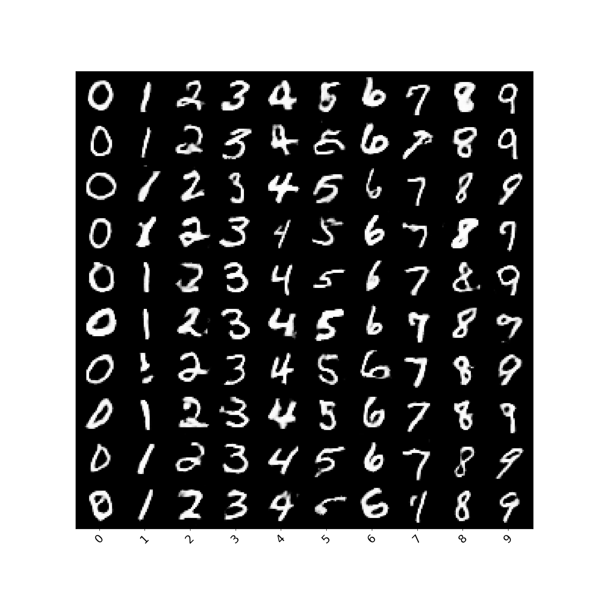
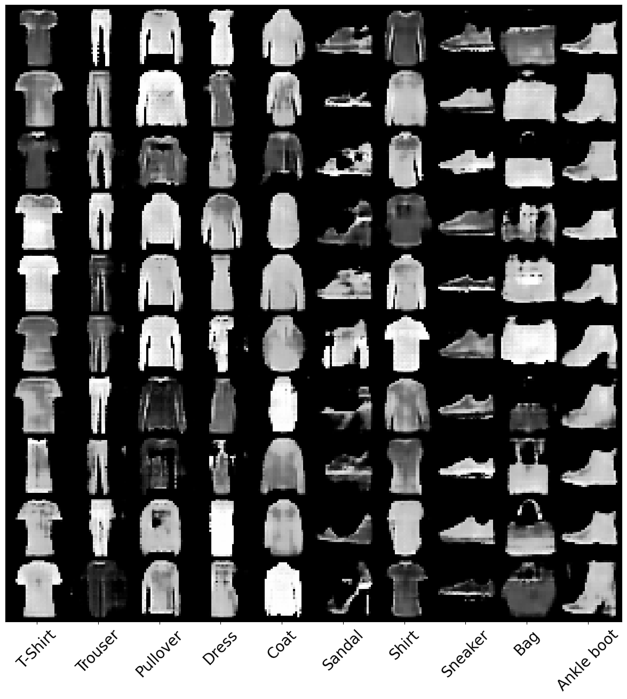

# ConditionalGAN Project

## Introduction
Conditional Generative Adversarial Networks (ConditionalGANs) enable image-to-image transformations based on additional input conditions such as labels or text. This allows for more precise control over the generated output, making it ideal for tasks like image synthesis from descriptions, photo editing, and more complex applications where conditions can direct the transformation. Our project provides an accessible, flexible framework for experimenting with ConditionalGANs across various domains.

## File structure
```
├── config.py                      # Configuration file containing parameters for model training and testing.
├── conditionalGANDatasetManager.py  # Dataset manager for loading and preprocessing datasets with conditions.
├── lossFunction.py                # Defines the loss functions used during training.
├── mainMNIST.py                   # Main execution file to run the training or testing process with MNIST dataset.
├── mainFashionMNIST.py            # Main execution file to run the training or testing process with FashionMNIST dataset.
├── model                          # Directory to store the trained model weights.
├── model.py                       # Defines the network structures for the generator and discriminator.
├── reference.py                   # Contains utility functions like image saving, logging, etc.
├── result                         # Stores images or other outputs from the model.
│   ├── resultMNIST.png            # Example output with MNIST dataset.
│   └── resultFashionMNIST.png     # Example output with FashionMNIST dataset.
└── train.py                       # Script containing the complete model training process.
```

## Installation
To use this CycleGAN implementation, you need to have Python 3.6 or later installed on your system. Follow these steps to set up the environment:
1. Clone this repository:
```
git clone https://github.com/Botang-Liao/GAN-ConditionalGAN.git
```
2. Navigate to the cloned directory:
```
cd ConditionGAN
```
1. Install the required dependencies:
```
pip install -r requirements.txt
```

## Usage
To run a ConditionalGAN model with our preconfigured datasets, use the following command run code with MNIST dataset:
```python
python mainMNIST.py 
```

and use the following command run code with FahsionMNIST dataset:
```python
python mainFashionMNIST.py 
```

## Results
The trained models, along with their outputs, will be saved in the `results` directory. This includes transformation examples from both domains and the loss metrics over the training period.

Below is an example result from our ConditionalGAN model:

- MNIST dataset:
    

- FashionMNIST dataset:
    
## References
This CondionalGAN implementation is inspired by the original paper:
- Mehdi Mirza, Simon Osindero, et al. "Conditional Generative Adversarial Nets".

## Acknowledgments
Special thanks to the CycleGAN contributors and the open-source community for making the resources available. This project was developed for educational purposes and is open for further improvements and contributions.